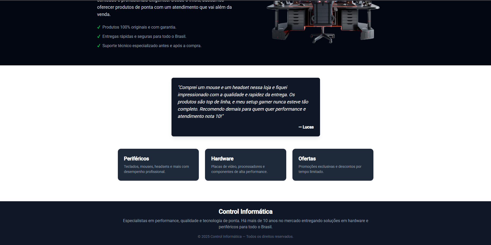
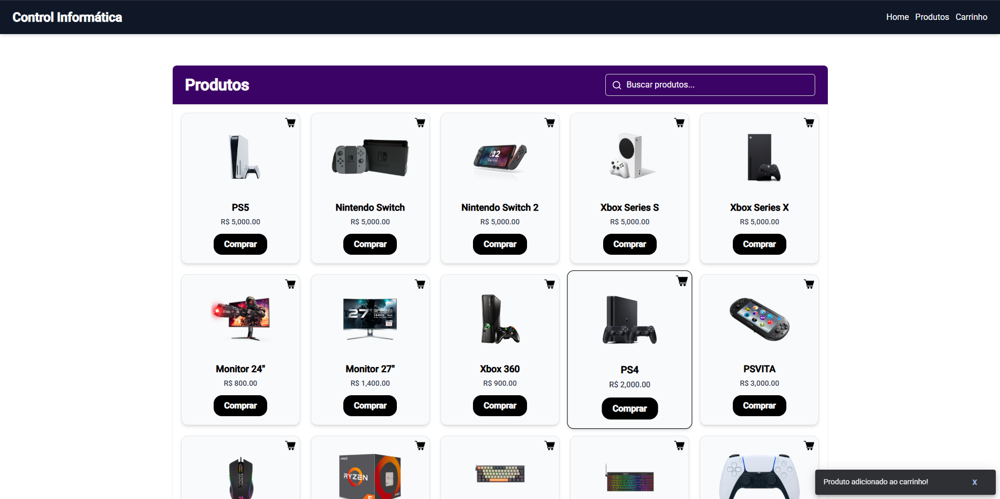
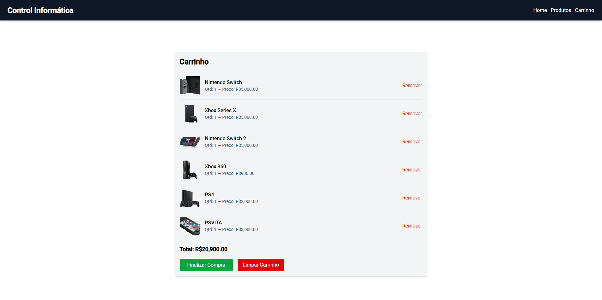
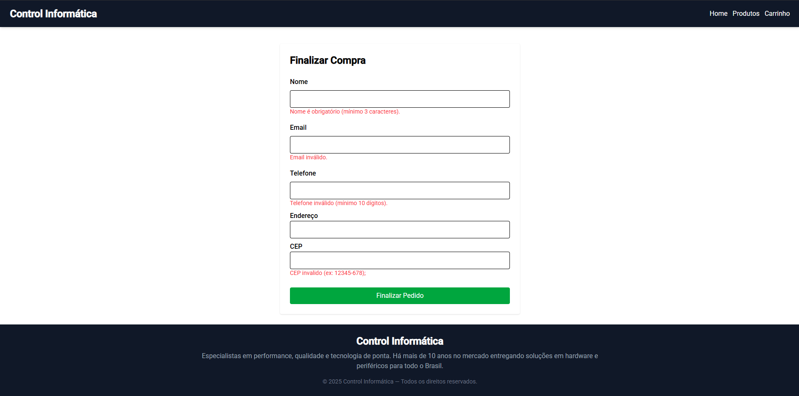

# Mini Ecommerce
Este é um **Mini Ecommerce** desenvolvido com **Angular**, **Tailwind CSS**, **TypeScript**, **Java**, **Spring** e **PostgreSQL**.
Link do repositório do [Backend](https://github.com/gxstavomiguel/ecommerce-backend).




## Tecnologias Utilizadas
-   **Angular** 
    
-   **Tailwind CSS**
    
-   **TypeScript**

## Funcionalidades

-   ✅ Navegação entre diferentes rotas
-   ✅ Pesquisar por produtos específicos
-   ✅ Adicionar produtos no carrinho
-   ✅ Registro de usuário e entrega 





## Como Rodar 
### Pré-requisitos:
-   Node.js 
-   Angular CLI  
-   Java 8 ou superior

1. **Clone os repositórios:**
   ```bash
   git clone https://github.com/gxstavomiguel/filmes-web-frontend
   git clone https://github.com/gxstavomiguel/ecommerce-backend
2. **Abra o frontend no Visual Studio Code e rode:**
``
	ng serve
   ``
3. **Abra o backend no Intellij e rode a classe main.**
``
	EcommerceApplication
   ``

4. **Inicie o projeto.**
   ```bash 
   A aplicação estará disponível em: http://localhost:4200


